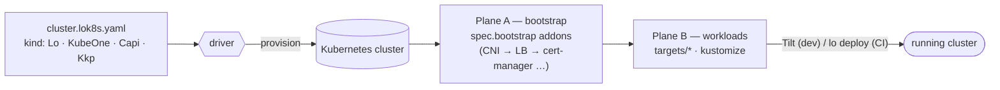

<h3 align="center">lok8s</h3>

<h6 align="center">
  <a href="#-install">Install</a>
  ·
  <a href="#-quick-start">Quick Start</a>
  ·
  <a href="#-how-it-works">How it works</a>
  ·
  <a href="#-ai-built-in">AI</a>
  ·
  <a href="#-cli-reference">CLI</a>
  ·
  <a href="https://lok8s.io/">Docs</a>
</h6>

<p align="center">
  <a href="https://github.com/kernpilot/lok8s/stargazers">
    
  </a>
  <a href="https://github.com/kernpilot/lok8s/releases/latest">
    
  </a>
  <a href="https://github.com/kernpilot/lok8s/actions/workflows/ci.yml">
    
  </a>
  <a href="https://github.com/kernpilot/lok8s/blob/main/LICENSE">
    
  </a>
</p>

&nbsp;

<p align="center"><b>Kubernetes, from your laptop to production — one CLI, one folder convention, the same workflow everywhere.</b></p>

<p align="left">
<b>lok8s</b> gives you a single CLI (<code>lo</code>) and a single per-domain folder layout for the whole journey: spin up a throwaway cluster on your laptop, iterate with a live dev loop, and ship the exact same definitions to production. It doesn't replace the tools you already know — <b>kustomize</b> builds your manifests, <b>Helm</b> charts inflate in place, <b>kind</b> runs clusters locally, and <b>Tilt</b> powers the hot-reload loop. lok8s is the thin, opinionated orchestration <i>around</i> them, so <code>clusters/&lt;your-domain&gt;/</code> means the same thing in dev, CI, and prod.
</p>

> Open-sourced in 2026 after **~9 years running real production workloads** — new to GitHub, but shaped by nearly a decade of operating clusters for keeps.

&nbsp;

### ✨ Why lok8s

- **🧰 Standard tools, not a walled garden.** Targets are plain `kustomize build`s; Helm charts inflate via the [khelm](https://github.com/mgoltzsche/khelm) kustomize plugin (no `helm` CLI to install). The `lo` CLI and the folder convention are *orchestration and ergonomics* — the artifacts underneath are vanilla Kubernetes YAML you could `kubectl apply` by hand. **No lock-in: lok8s produces standard manifests you can take anywhere.**
- **💻 Dev-first, runs against any cluster.** The default experience is a local `kind` cluster with TLS, a registry mirror, and a Tilt hot-reload loop that just works. `lo build` emits portable `artifacts.yaml`; point `lo deploy` at *any* cluster you have a kubeconfig for. The Hetzner/KubeOne/CAPI provisioners are a *convenience* for standing up production — **not a requirement**.
- **🤖 AI built in, local-first.** `lo chat` is an on-device assistant for your cluster (read-only by default, with a code-enforced safety gate), and `lo mcp` exposes every `lo` command to agents like Claude Code over [MCP](https://modelcontextprotocol.io/). No data leaves your machine unless you explicitly opt into a frontier model.
- **🧪 Battle-tested.** The conventions here aren't speculative — they're the residue of ~9 years of running this in production, keeping what survived contact with reality and dropping what didn't.
- **🐚 Transparent and debuggable.** The CLI is bash (via [argsh](https://github.com/arg-sh/argsh)) — the same `kubectl`/`kustomize`/`kind` commands you'd run by hand, just orchestrated. Nothing is hidden behind a compiled black box; you can read, lint, and step through every step. ([Why bash?](#-why-bash--argsh))

&nbsp;

### 🧭 Philosophy

A few principles shape every decision in lok8s:

1. **Production is the reference; local dev is a nerfed overlay of it.** You don't learn one workflow for your laptop and a different one for prod — it's the same tree, the same commands, the same `cluster.lok8s.yaml`. The local cluster is just production with the expensive parts swapped out.
2. **One cluster = one folder, keyed by FQDN.** Everything about a cluster lives under `clusters/<fqdn>/`. The domain *is* the identity, which makes multi-cluster and multi-environment setups obvious rather than clever.
3. **Stand on standard tools.** lok8s orchestrates kustomize, Helm (via khelm), kind, and Tilt — it doesn't reimplement them. If you know those, you already know most of lok8s.
4. **Two concerns, kept apart.** *Cluster creation* (a pluggable driver) is separate from *cluster content* (kustomize targets). Swapping how a cluster is born never touches what runs on it.
5. **Minimal magic, maximal transparency.** Rendered artifacts are plain YAML, the CLI is readable bash, and the only ordering primitive is an explicit `spec.bootstrap` list. When something breaks, you can see exactly what ran.

&nbsp;

### ✅ When to use lok8s (and when not to)

Honesty up front — lok8s is opinionated, and that won't fit everyone.

**Reach for lok8s when you want to…**

- Have the *same* workflow from local kind to production instead of maintaining two parallel setups.
- Manage one or many clusters with a clear, FQDN-keyed folder convention.
- Keep a fast local dev loop (Tilt hot-reload, local registry, working TLS) without bespoke glue.
- Use kustomize + Helm charts as your manifest layer and want ergonomics around them.
- Provision on Hetzner (kind/KubeOne/CAPI) with sensible, batteries-included defaults — or just deploy to a cluster you already have.

**Look elsewhere (or use lok8s only for the deploy side) when…**

- You're fully invested in a managed platform's native workflow (EKS/GKE/AKS + their tooling) and don't want another convention on top.
- You prefer a pure-GitOps, controller-driven model (Argo/Flux as the source of truth) — lok8s can emit manifests for that, but its dev-loop is CLI/Tilt-centric, and the in-tree `lo gitops` layer is still being built.
- You need turnkey production provisioning on a cloud other than Hetzner today — the provisioning drivers currently target Hetzner. (You can still deploy lok8s-built artifacts to *any* cluster; you'd just bring your own provisioning.)
- A compiled, single-binary tool with no bash anywhere is a hard requirement for your team.

&nbsp;

### 📦 Install

One command bootstraps a lok8s project in the current directory — it installs
[`b`](https://github.com/fentas/b) (the environment manager) if missing, pulls the framework plus your
profile's pinned toolchain into `.bin/`, and drops a re-runnable `lo-up`:

```bash
curl -fsSL https://get.lok8s.io | sh
```

It prompts when a terminal is attached and runs unattended otherwise:

```bash
curl -fsSL https://get.lok8s.io | sh -s -- -y               # no prompts (CI)
curl -fsSL https://get.lok8s.io | sh -s -- -p kubeone -y    # a specific profile
```

> **Rather inspect before running?** Good instinct.
> `curl -fsSL https://get.lok8s.io -o lo-up`, read it, then `sh lo-up`. The
> script is self-contained (the argsh runtime is bundled) and also published at
> [lok8s.io/lo-up](https://lok8s.io/lo-up).

<details>
<summary>Other ways to install (drive <code>b</code> yourself, or use <code>mise</code>)</summary>

```bash
# Drive b directly
curl -fsSL https://get.binary.help | sh          # install b
b env add github.com/kernpilot/lok8s#local       # add a profile (local dev)
b install                                         # pull it into the project
```

**Prefer [mise](https://mise.jdx.dev)?** A `mise.toml` ships at the repo root —
`mise install && mise activate` provisions the same toolchain. Then `lo doctor` to verify.

**Cloning the repo directly?** The `argsh` runtime is vendored in `.bin/`, so
`lo doctor` runs immediately and tells you which tools are still missing — no
`b install` needed just to diagnose the environment.
</details>

**Profiles** — each ships only the binaries it needs:

| Profile | Adds | Use case |
|---------|------|----------|
| `core` | framework only | Remote deploy only — no kind/Tilt |
| `kustomize` | kustomize plugins | Standalone kustomize plugin use |
| `local` | kind, Tilt, mkcert | **Local dev** (recommended starting point) |
| `capi` | `clusterctl`, `hcloud` | Cluster API provisioning |
| `kubeone` | `kubeone`, `hcloud` | KubeOne provisioning |

Every profile ships a preconfigured `clusters/lok8s.dev/` — a local cluster with working TLS out of the box. Bring your own FQDN later, or use `*.[N].lok8s.dev` for multiple projects.

**Prerequisites:** Docker, and **bash ≥ 4.3** (macOS ships 3.2 — `brew install bash`). Everything else comes from `b` (or `mise`). Run `lo doctor` to check.

&nbsp;

### 🐾 Quick Start

From zero to a running local cluster with a live dev loop:

```bash
lo use lok8s.dev          # select the active domain (ships preconfigured)
lo up                     # create the kind cluster, bootstrap infra, start Tilt
                          # → Tilt UI on the URL it prints (per-domain port, 10351–10499)
lo status                 # Running ✓
lo down                   # tear it all down when you're done
```

That's the interactive loop. For headless/CI or deploying to a remote cluster, the same definitions drive a build → deploy pipeline:

```bash
lo build                  # render every kustomize target → artifacts/<target>/artifacts.yaml
lo deploy                 # apply built artifacts (CRDs first, then resources, with health waits)
lo lint                   # validate specs, bootstrap entries, and target references
```

`lo build`'s output is plain Kubernetes YAML — `kubectl apply -f clusters/<domain>/artifacts/<target>/artifacts.yaml` works against any cluster, with or without the rest of lok8s.

&nbsp;

### 🧠 How it works

lok8s keeps two concerns strictly separate:

1. **Cluster creation** — *how the cluster comes to exist.* Handled by a **driver** (`.lok8s/drivers/<kind>/main`), selected by the `kind:` of your `cluster.lok8s.yaml`.
2. **Cluster content** — *what runs on it.* Plain kustomize, split into two planes: ordered **bootstrap** infrastructure and independent **workload** targets.

Everything is keyed by FQDN. A **cluster domain** owns a cluster (`cluster.lok8s.yaml`); a **deployment domain** ships content to another domain's cluster (`deploy.lok8s.yaml`).



Concretely, `lo up` runs:

```
lo up                    # domain comes from `lo use` / --domain
 ├─ provision   driver creates the cluster        (kind / KubeOne / CAPI / KKP)
 ├─ bootstrap   framework applies spec.bootstrap   (CNI → MetalLB → cert-manager → …,
 │              addons in order, waits healthy      health-gated between stages)
 └─ tilt up     Tilt builds & live-reloads          (or: lo build + lo deploy, headless)
```

The two content planes:

- **Plane A — bootstrap (cluster infrastructure).** An ordered `spec.bootstrap` list of framework addons (CNI, load balancer, cert-manager, …) applied at provision time, with health waits between stages. The cluster isn't "ready" until this finishes.
- **Plane B — workloads.** User-named kustomize directories under `targets/`, each built independently into its own `artifacts.yaml`. No framework-level ordering — you express any ordering you need with Tilt's `resource_deps` or your GitOps engine.

**Drivers** are pluggable cluster backends:

| Kind | Runtime | Use for |
|------|---------|---------|
| **`Lo`** | Docker + kind | Local dev / CI |
| **`KubeOne`** | KubeOne (Hetzner) | Self-managed production |
| **`Capi`** | Cluster API (Hetzner / CAPH today) | Declarative production provisioning |
| **`Kkp`** | Kubermatic KKP | Hosted control planes |

> The four drivers share one `.lok8s/` tree and one spec format. `Lo` (local) needs nothing but Docker; the production drivers target Hetzner today but are **optional** — you can run lok8s entirely against clusters you provision yourself. Adding a driver for another backend is a documented extension point (see [Extensibility](#-extensibility)).

For the full model — layer map, atoms/molecules, build/deploy pipeline — see [ARCHITECTURE.md](ARCHITECTURE.md) and the [Concepts guide](docs/guide/concepts.md).

&nbsp;

### 🗂️ The `clusters/<fqdn>/` convention

This single convention is what makes the "same workflow everywhere" promise hold. The framework (`/.lok8s/`) stays flat and framework-owned; **your** content lives in a parallel `clusters/` tree, one directory per cluster, named by its FQDN:

```
clusters/
├── lok8s.dev/                  # local dev cluster (ships with lok8s)
│   ├── cluster.lok8s.yaml       #   the spec — kind, bootstrap, network, …
│   ├── targets/                 #   workload plane: one kustomize dir per target
│   │   ├── platform/
│   │   └── apps/
│   ├── artifacts/               #   rendered output (gitignored, rebuilt on demand)
│   └── secrets/                 #   per-domain secret store (encrypted, opt-in)
├── cluster.example.in.net/     # production cluster (same structure!)
│   └── cluster.lok8s.yaml
└── api.example.com/            # deployment domain → deploys onto another cluster
    └── deploy.lok8s.yaml
```

Why this is powerful:

- **The folder name is the cluster's API hostname**, so the same brand can be served by different environments without collisions (`clusters/example.com/` locally, `clusters/cluster.example.in.net/` in prod).
- **Secrets are per-domain** (`clusters/<domain>/secrets/`), so dev and prod can never accidentally cross-pollinate credentials.
- **A `Deploy` domain** carries no cluster of its own — it `clusterRef`s another domain and ships workloads there, which is how one repo can target many clusters.
- It's just folders and YAML — diff-able, reviewable, and obvious to a newcomer.

See [ARCHITECTURE.md](ARCHITECTURE.md) for the complete tree and [Specs reference](docs/reference/specs.md) for every field.

&nbsp;

### 💻 Local development

The local experience is the part lok8s polishes hardest, because it's where you live day to day:

- **One command, full loop.** `lo up` creates a `kind` cluster, applies your `spec.bootstrap` infrastructure, and starts **Tilt** — which reads your `services.yaml`, builds images, wires `docker_build` + `live_update`, and gives you a UI at the URL it prints (a per-domain port in `10351`–`10499`, so parallel projects never collide). Edit code → Tilt syncs and reloads. ([Local Dev guide](docs/guide/local-dev.md))
- **Working TLS, no manual cert juggling.** The `secrets.lok8s.dev` kustomize plugin's `cert:` generator mints leaf certificates from a shared local dev CA — no `mkcert` dance per project. `lo trust` adds the CA to your system store so browsers are happy. ([Secrets guide](docs/guide/secrets.md), [Kustomize plugins](docs/reference/kustomize-plugins.md))
- **Fast, shared registry mirrors.** A pull-through mirror network is shared across all your lok8s projects, so images are pulled once, not once-per-cluster. Opt out per project if you'd rather not. ([Shared Registries guide](docs/guide/shared-registries.md))
- **Multi-project friendly.** Use `*.[N].lok8s.dev` slots to run several local clusters on isolated Docker networks side by side.

Define services once, in a committed `services.yaml`, with personal overrides in a gitignored `services.<config>.yaml` ("I'm not working on the frontend today" → `enabled: false`). Each buildable service carries a small `lok8s.yaml` describing its build, ports, and live-update rules. ([Services guide](docs/guide/services.md))

&nbsp;

### 🚀 Production & deploying anywhere

Two honest paths to production:

1. **Provision with lok8s (Hetzner today).** The `KubeOne` and `Capi` drivers stand up real clusters on Hetzner Cloud (and bare metal via Hetzner Robot), with batteries-included networking, CNI, encryption-at-rest, and backups guidance. ([CAPI](docs/guide/capi.md) · [Bare Metal](docs/guide/bare-metal.md) · [Networking](docs/guide/networking.md) · [Security](docs/guide/security.md) · [Backups](docs/guide/backups.md))
2. **Bring your own cluster.** `lo build` renders standard `artifacts.yaml`; `lo deploy` applies it to whatever cluster your kubeconfig points at (use `--remote`/`--cluster` for an existing cluster). EKS, GKE, a Raspberry Pi, a colleague's kind cluster — if `kubectl` can reach it, lok8s can deploy to it.

The optional **operator** ([shell-operator](https://github.com/flant/shell-operator)-based) reconciles `Lo` and `Capi` CRDs on a management cluster using the *same* bash libraries as the CLI, so cluster lifecycle can be declarative when you want it. ([Operator guide](docs/guide/operator.md))

> The hosted, managed-platform layer (kubehz) is a separate product built *on top of* lok8s — lok8s works fully without it. No-lock-in is a design goal, not a slogan.

&nbsp;

### 🤖 AI, built in

lok8s treats AI as a first-class, **local-first** capability — not a cloud dependency.

- **`lo chat` — an on-device cluster assistant.** Ask "why won't this deploy?" or "what's the LB IP?" and it routes through `lo` tools, gathers facts, and streams a markdown answer in your terminal. It runs **read-only by default**, enforced in *code* (not by trusting the model), so it can't mutate your cluster unless you switch posture with `/posture open`. Backends are local: [Ollama](https://ollama.com) or any OpenAI-compatible server (llama-server, [llamafile](https://github.com/Mozilla-Ocho/llamafile), vLLM). Frontier CLIs (claude/gemini/codex) are strictly opt-in handoffs. Run `lo chat --check` for a guided setup. ([Local AI guide](docs/guide/lo-chat.md))
- **`lo mcp` — your CLI as agent tools.** Every leaf `lo` command is exposed as an [MCP](https://modelcontextprotocol.io/) tool (`lo_status`, `lo_build`, `lo_deploy`, …) over stdio, so agents like Claude Code or Cursor can drive lok8s the same way you do. Commands are tagged `@readonly` / `@idempotent` / `@destructive`, and a deterministic posture gate decides what an agent may actually run. A ready-to-use `.mcp.json` ships in the repo root.
- **`lo ai` — wire skills into your assistant.** The repo ships curated [skills](skills/) (cluster specs, services, addons, secrets, the dev loop, troubleshooting…). `lo ai link claude` symlinks them into `.claude/skills/` for native loading; other agents get them by injection. `lo ai check` reports the whole setup at a glance.

Try it in two commands:

```bash
lo chat --check    # guided: checks the bridge + a local model, prints setup hints
lo chat            # then ask, e.g. "why won't my deployment start?"
```

If a piece needs setup (e.g. the MCP bridge wants `argsh builtins install`), `lo ai check` / `lo doctor` tell you exactly what to run.

&nbsp;

### 🧩 Extensibility

lok8s is conventions, not a cage — every layer has a documented seam:

- **Custom cluster drivers.** A driver is a bash file at `.lok8s/drivers/<kind>/main` implementing four functions — `driver::provision`, `driver::destroy`, `driver::status`, `driver::kubeconfig` (plus an optional `driver::post_provision`). Set `kind: <YourKind>` in the spec and lok8s dispatches to it. The [Driver Contract reference](docs/reference/kind-contract.md) includes a complete worked example (a k3s driver).
- **Your own addons.** Drop a kustomize-buildable directory at `.lok8s/addons/<name>/` (a [khelm](https://github.com/mgoltzsche/khelm) `ChartRenderer` + layered `values.<driver>.yaml`/`values.<provider>.yaml`, or any plain kustomization) and reference it by name in `spec.bootstrap`. ([Addons guide](docs/guide/addons.md))
- **Adopt what you already have.** Point a target's `kustomization.yaml` at an existing kustomize base (`resources: [ ../path/to/your/kustomization ]`), or inflate an existing Helm chart via a khelm `ChartRenderer` — no rewrite required.
- **Add tools.** The toolchain is managed by [`b`](https://github.com/fentas/b): add an entry to `.bin/b.yaml`, assign it a profile group, `b install`, and it's on `PATH`.

&nbsp;

### 🐚 Why bash + argsh?

It's a fair question, so here's the honest answer. The `lo` CLI is bash, built on [argsh](https://github.com/arg-sh/argsh).

- **Bash is the native glue for Kubernetes tooling.** lok8s' job is to orchestrate `kubectl`, `kustomize`, `kind`, `clusterctl`, `kubeone`, and friends — which are themselves CLIs. Bash calls them directly, with no SDK drift or version-matrix games. What lok8s runs is what you'd run by hand.
- **Transparency and debuggability.** There's no compiled binary hiding the logic. `lo --verbose` shows every command; you can read the libraries under `.lok8s/`, set `set -x`, and step through a provision. When production breaks at 2am, "it's just shell" is a feature.
- **argsh makes the bash sane.** argsh adds typed argument parsing, generated `--help`, subcommand dispatch, and structure — so the code reads like a real CLI, not a pile of `getopts`. It's `shellcheck`-clean in CI (no new warnings allowed), and the *same* argsh metadata that powers `--help` is what generates the [MCP tool schema](#-ai-built-in) for free.

The kustomize plugins and the `lo chat` engine, where a typed/compiled language genuinely fits, are written in **Go**. Bash is used where it's the right tool, not everywhere.

&nbsp;

### 🔧 CLI Reference

| Command | Description |
|---------|-------------|
| `lo use [domain]` | Set / show the active domain |
| `lo up [--open-tilt]` | Provision cluster + bootstrap + start Tilt |
| `lo down` | Stop Tilt + delete the cluster |
| `lo status [domain]` | Cluster health + per-target build state |
| `lo provision [domain]` | Full lifecycle: create + bootstrap + build + deploy |
| `lo build [domain] [target…]` | Render kustomize targets → `artifacts/` |
| `lo deploy [--filter k=v] [domain] [target…]` | Apply built artifacts (CRDs → resources → health) |
| `lo lint [domain]` | Validate specs, bootstrap entries, target refs |
| `lo doctor` | Diagnose the local environment / toolchain |
| `lo addons [name]` | List / inspect framework bootstrap addons |
| `lo kubeconfig [domain]` | Print a domain's kubeconfig (`--oidc` for the kubelogin exec-plugin) |
| `lo destroy [domain]` | Tear down a cluster |
| `lo clean [--all]` | Clean volumes; optionally prune Docker |
| `lo chat` | Local AI assistant (read-only by default) |
| `lo ai check\|skills\|link\|unlink` | Manage AI skills + integration |
| `lo mcp` | Start the MCP tool server (stdio) |
| `lo tilt up\|down\|status\|restart` | Manage the Tilt environment |
| `lo registry up\|down\|status\|clean` | Manage registry mirrors |

Global flags: `--verbose|-v`, `--force|-f`, `--remote|-r`, `--cluster|-s`, `--kubernetes`, `--config`, `--domain`, `--domain-sans`. Full reference: [docs/reference/cli.md](docs/reference/cli.md).

&nbsp;

### 📚 Documentation

Full documentation lives at **[lok8s.io](https://lok8s.io/)**. Good entry points:

- **[Getting Started](docs/guide/index.md)** · **[Concepts](docs/guide/concepts.md)** · **[Architecture](ARCHITECTURE.md)**
- **Workflows:** [Local Dev](docs/guide/local-dev.md) · [Services](docs/guide/services.md) · [Secrets](docs/guide/secrets.md) · [Deploying](docs/guide/deployment.md) · [Local AI](docs/guide/lo-chat.md)
- **Production:** [CAPI](docs/guide/capi.md) · [Bare Metal](docs/guide/bare-metal.md) · [Networking](docs/guide/networking.md) · [Operator](docs/guide/operator.md)
- **Reference:** [CLI](docs/reference/cli.md) · [Specs](docs/reference/specs.md) · [Driver Contract](docs/reference/kind-contract.md) · [Kustomize Plugins](docs/reference/kustomize-plugins.md)

```bash
npm run docs:dev        # local docs site
npm run docs:build      # build
```

&nbsp;

### 🤝 Contributing

Contributions are welcome — see [CONTRIBUTING.md](CONTRIBUTING.md) and the agent/contributor guide in [AGENTS.md](AGENTS.md). In short: conventional commits, keep CI green (`npm run lint` + `npm test`), and **security is paramount** — never pipe *untrusted* remote content into a shell, never commit secrets, validate external input.

&nbsp;

### 🔗 Related projects

lok8s is built on — and shares a philosophy with — a few sibling tools:

- **[`b`](https://github.com/fentas/b)** · [binary.help](https://binary.help) — your one-stop binary manager. It installs and pins lok8s' toolchain, and lok8s ships as a `b` profile.
- **[`argsh`](https://github.com/arg-sh/argsh)** · [arg.sh](https://arg.sh) — the framework the `lo` CLI is built on; it brings structure and maintainability to complex Bash (typed args, dispatch, and the metadata that becomes lok8s' `--help` and MCP tool schema).
- **[`atty`](https://github.com/fentas/atty)** · [atty.sh](https://atty.sh) — a suckless-style PTY proxy (Zig) that drops an LLM exec dialog, atuin autosuggest, and guardrail confirmations between your terminal and your shell.

&nbsp;

### 📜 License

[MIT](LICENSE) © 2025-present [kernpilot](https://github.com/kernpilot)

<p align="center">
  <a href="https://github.com/kernpilot/lok8s/blob/main/LICENSE">
    
  </a>
</p>
